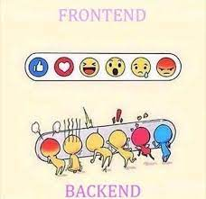
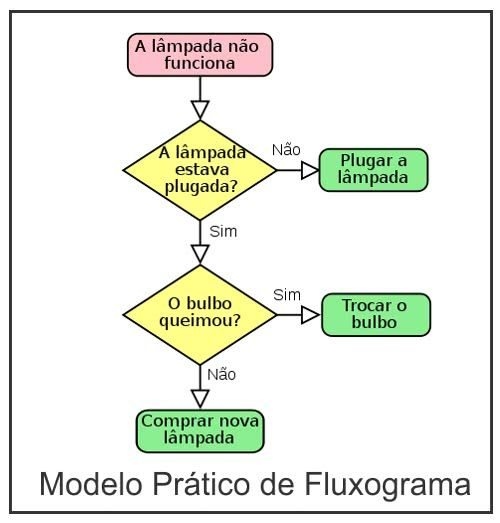
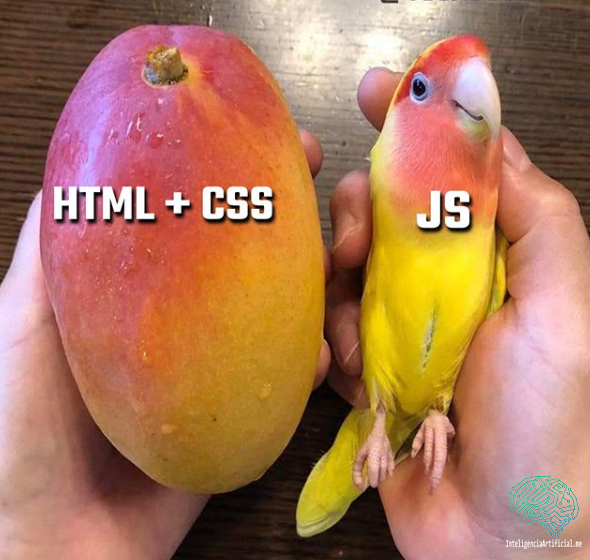
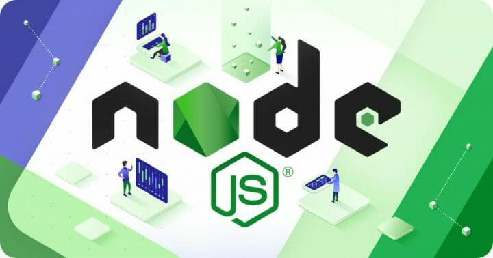

# ON15-TodasEmTech-S2-Lógica de Programação-I

Esta é a 2ª semana da turma online Todas em Tech - Back-end, nesta aula do dia 02/04/2022 teremos os seguintes conteúdos:

- O que é Lógica de Programação?
- O que é Javascript?
- Tipos de dados
- Variáveis
- Operadores
- Estruturas Condicionais

## Apresentação

### Quem é a professora Lilit?


[Lilit Bandeira](https://www.instagram.com/lilitravesti), é uma travesti paraibana residente no São Paulo, Software Engineer no Nubank, ex-aluna {reprograma} e professora também no minas programam;

#### Contatos

- E-mail: devlilitbandeira@gmail.com
- [LinkedIn](https://www.linkedin.com/in/lilitbandeira)
- [GitHub](https://github.com/lilitbandeira)

### Quem são as monitoras?


### Quem são as alunas?


## Acordos

- Enviar dúvidas no chat com as monitoras;
- Levantar a mão sempre que desejar falar, o que pode ser feito a qualquer momento;
- Manter microfones desligados sempre que alguém estiver falando;
- Manter as câmeras ligadas o máximo de tempo possível;

## Plano de aula

### 1. Backend e Frontend



#### 1.1. Frontend (Client-side) 

Parte visual e de interação direta com a pessoa usuária em uma aplicação ou site;

#### 1.2. Backend (Server-side) 

Parte "que fica por trás" de uma aplicação, onde há o armazenamento de dados (banco de dados), o tratamento e processamento de dados de acordo com as regras do sistema e as validações e garantias necessárias para a segurança e a qualidade da aplicação.

---
### 2. Lógica de Programação

#### 2.1. Como um programa funciona?

##### 2.1.1. Partes que compõem um programa
    
Entrada, processamento e saída de dados;

Exemplo do caixa eletrônico de um banco.¹

- Entrada de dados;
- Escolha da operação desejada;
- Exibição dos dados ou do status da solicitação;

##### 2.1.2. Fluxos

- Programação sequencial (uma tarefa após a outra); 
- Programação condicional (uma verificação a partir do conceito de verdadeiro e falso que determina o que ocorre a seguir); 
- Programação de Repetição (instruções que definem um padrão de repetição finito);

| A lógica é sobre organizar pensamentos, colocando-os em ordem e decidindo a partir de deduções as melhores soluções para os problemas encontrados, com a lógica somos capazes de compreender o que é pedido, realizar deduções lógicas, enumerar etapas, analisar outras possibilidades, ensinar ao computador a sua solução, analisar detalhes.

#### 2.2. Algoritmo

Sequência de passos/comandos finitos a serem executados para a realização de uma tarefa/funcionalidade e/ou a solução de um problema.

##### Vamos criar um Algoritmo?

#### 2.3. Fluxogramas

É uma forma de estruturar e visualizar, através de um mapa, uma cadeira de processos usando simbologias próprias para ilustrar as etapas de um sistema, com as coordenadas para o desenvolvimento, de forma organizada e de fácil leitura;



#### 2.4. Linguagens de programação

A linguagem de programação é um método padronizado, formado por um conjunto de regras sintáticas e semânticas, de implementação de um código fonte - que pode ser compilado e transformado em um programa de computador, ou usado como script interpretado - que informará instruções de processamento ao computador.
    - Sintaxe é uma coleção de normas que especificam a construção da estrutura do código (forma), determinando combinações de símbolos e palavras-chaves podem ser utilizadas em uma determinada linguagem;
    - Semântica é o significado associado dos símbolos, caracteres ou qualquer parte de um programa (interpretação do código);

| A lógica aplicada a uma linguagem de programação vai produzir um sistema.

--- 
### 3. JavaScript


É uma linguagem conhecida como uma linguagem de front-end, por ser utilizada por praticamente todos os sites e aplicações web e por ser a linguagem nativa nos navegadores web atuais, não sendo necessária nenhuma instalação de plug-in ou compilação para sua execução; O JS forma com o HTML e o CSS a tríade base para a construção de uma página ou aplicação web, sendo responsável por definir comportamentos dos elementos da página/app. 



| “Os cógidos escritos em JavaScript, também chamados de scripts, são interpretados diretamente pelos navegadores web”.¹

Apesar de sua fama no front-end, o JavaScript também é uma linguagem capaz de rodar no lado do servidor (backend), ou seja, também pode ser executada em um programa instalado no servidor, retornando para a máquina do cliente apenas o código resultante desta execução, tal qual Java, PHP, C#, Python entre outras.

#### 3.1. NodeJs (Runtime JavaScript construído no mecanismo JavaScript V8 do Chrome)



- Runtime: Máquina virtual que gerencia um programa escrito em uma linguagem de computador enquanto está sendo executado.

- Motor V8: é um mecanismo de alto desempenho escrito em C++ que implementa o ECMAScript e é executado no Windows 7 ou posterior, macOs 10.12+ e Linux, podendo ser executado de forma independente;

| “O NodeJS é um software de código aberto, multiplataforma, baseado no interpretador V* do Goggle Chrome que permite a execução de códigos JavaScript fora de um navegador web".²

Em termos mais acessível é um interpretador JAvaScript baseado no motor V8 do google, o mesmo usado no chrome, que permite rodar códigos JavaScript em qualquer servidor, sem a dependência de um navegador.

--- 
### 4. Instalando VSCode e NodeJS
---
### 5. Tipos de dados

Os tipos de dados estão extremamente relacionados ao contexto de negócio em que está inserido o sistema que iremos construir ou melhorar, entendê-los possibilita resolver problemas diversos relacionados à algoritmos e estruturas de dados em sistemas complexos;

O JavaScript é uma linguagem dinamicamente tipada ou de tipagem fraca, isso significa que os tipos dos dados num código JS são definidos e redefinidos de acordo com a execução deste código, não sendo necessário que a pessoa programadora defina explicitamente o tipo de dado que será armazenado/processado durante a construção do código;

#### 5.1. String

É uma sequência de caracteres que formam palavras, frases ou qualquer formação que será tratado como um texto, este tipo é comumente representado nas linguagens de programação com a utilização de aspas simples ou duplas, tendo o JavaScript ainda uma terceira forma com a utilização de crase:

```jsx
"Turma on15 backend"
'Todas em tech'
`Lógica de Programação` // Chamamos esta forma de template string ou string literal
```

##### 5.1.1. Concatenação

É a operação de unir o conteúdo de duas ou mais strings;

```jsx
console.log('Lilit Bandeira tem' + 33 + 'anos')
console.log("Lilit Bandeira tem " + 19 + " anos")
console.log(`Lilit Bandeira tem ${33} anos`)
```

#### 5.2. Number

É o tipo numérico primitivo do JavaScript , sendo divididos basicamente em números inteiros `int` ou ponto flutuante `float`, que são os números decimais;

```jsx
3
9.123
"4" // neste caso é uma string e não um number
```

#### 5.3. Boolean

Outro tipo primitivo também conhecido como tipo lógico, que tem apenas dois valores, que representam verdadeiro (`true`) ou falso (`false`), que podemos considerar como os binários `1` e `0`.

#### 5.4. `undefined`

Valor dado para uma variável indefinida; 

#### 5.5. `null`

Representa um objeto vazio, um valor nulo, ou seja, um objeto inexistente;

#### 5.6. Objetos

Um objeto é uma coleção de dados e instruções/funcionalidades para se trabalhar com esses dados, os objetos são mapeamentos de chaves e valores, onde as chaves são strings e os valores podem ser qualquer tipo de dado. No JavaScript podemos dizer que tudo é um objeto, pois é criado a partir de um objeto pre existente na estrutura da linguagem;

```jsx
{
    nome: "Lilit",
    signo: "Aquário",
    idade: 33 
}
```
---
### 6. Variáveis

Uma variável é um símbolo que referencia um espaço na memória do computador utilizado para armazenar dados que serão utilizados pelo programa em questão.

Para criar variáveis no JavaScript seguimos algumas regras importantes, a primeira e mais importante é que usamos uma das palavras reservadas `var`, `let` ou `const` para reservar o espaço na memória onde o dado será armazenado.

```jsx
var nome = "Lilit"
const sobrenome = "Bandeira"
let telefone = 11949801350
```

A segunda, baseada no exemplo das variáveis acima, é que para atribuir um valor a uma variável temos a seguinda estrutura:

```jsx
// palavra reservada -> var, const ou let
// identificador -> nomeDaVariável
// operador de atribuição -> =
// dado atribuido à variável -> String, number, boolean...
 
var curso = "reprograma" 
let numeroDaTurma = 15
const turmaEmAndamento = true
```

A terceira, também seguindo o exemplo das variáveis acima, o JavaScript é case sensitive, ou seja é sensível as diferenças entre letras maísculas e minúsculas, além de seguir o padrão camelCase, ou seja, para criar variáveis com nomes compostos, juntamos as palavras sempre iniciando a próxima com letra maiúscula, o que cria uma silhueta que remete a um Camelo, dizem shuahsuah

```jsx
//nomedaaluna não é a mesma coisa de nomeDaAluna
```

Outras regrinhas importantes:

- As variáveis devem ter seus identificadores iniciando com letra (convencionalmente minúscula), underscore e cifrão e não podem iniciar com números;
- No corpo do identificador ainda podem haver números e símbolos, mas não pode conter espaço;
- Não é possível usar uma palavra reservada para  nomear uma variável;

Dica de boa prática:

- Utilize nomes descritivos para as variáveis, que ao ler, qualquer outra pessoa desenvolvedora que esteja lendo o código possa identificar o tipo de dado e seu objetivo no código, é mais indicado usar um identificador grande e descritivo do que pequeno e genérico

```jsx
let cidadeOndeNasceu = "Rio de Janeiro"
let cidNasc = "Rio de Janeiro"
```

Quando usar `var`, `let` e `const`?

- `var`: variáveis de escopo global, podem ser definidas, acessadas e atualizadas em qualquer parte do código;
- `let`: variáveis de escopo definido e bloqueado, não podem ser acessadas fora do escopo onde foram definidas, porém podem ser atualizadas;
- `const`: são constantes, ou seja variáveis imutáveis, não podem ser atualizadas, além disso, como o caso da `let` possui escopo definido e bloqueado, não podendo ser acessadas fora do escopo onde foram definidas;

É altamente recomendável utilizar `var` apenas em casos onde seja necessário, a boa prática é utilizar `let` e `const` para manter suas variáveis no escopo desejado e evitar que sofram mudanças indesejadas;

---
### 7. Operadores

Os operadores são fundamentais para realizar qualquer operação numa linguagem de programação, sejam operações matemáticas, de comparação ou lógicas.

#### 7.1. Tipos

- Binários:

```jsx
1 + 2
// valor1 operador valor2
```

- Unários:

```jsx

let i = 5
i++ // valor operador
console.log(i)
console.log(++i) // operador valor
```

- Ternário (Condicional):

```jsx
let sistema = "android"
sistema == "ioS" ? console.log("é iphone") : console.log("não é iphone")
// condição ? caso verdadeiro : caso falso
```

#### 7.2. Operadores Aritméticos

- `+` → adição
- `-` → subtração
- `*` → multiplicação
- `/` → divisão
- `%` → módulo/resto
- `++` → incremento
- `—` → decremento
- `**`  → exponencial

#### 7.3. Operadores de Atribuição

- `=` → atribuição
- `+=` → atribuição de soma
- `-=` → atribuição de subtração
- `*=` → atribuição de multiplicação
- `/=` → atribuição de divisão
- `%=` → atribuição de resto
- `**=` → atribuição de exponencial

#### 7.4. Operadores de Comparação

- `==` → igual
- `===` → estritamente igual
- `≠` → não igual
- `>`→ maior
- `≥` → maior ou igual
- `≤` → menor ou igual
- `<` → menor

#### 7.5. Operadores lógicos

- `&&` → e
- `||` → ou
- `!` → não
---
### 8. Estruturas condicionais

São instruções da linguagem baseadas no binário lógico `true` ou `false` (1 ou 0) que nos permite desviar o fluxo do algoritmo de acordo com um teste baseado em condições.

#### 8.1. `If ... else`

A condicional `if` é uma estrutura condicional que executa a afirmação, dentro do bloco, se determinada condição for verdadeira. Se for falsa, executa as afirmações dentro de `else`. *(MDN)* Podemos encadear vários ifs com `else if`

```jsx
const horario = 7; // valor esperado entre 0 e 23
```

```jsx
if (horario < 12) {
  console.log("dia");
} else {
  console.log("noite");
}
```

Podemos reduzir ao operador ternário:

```jsx
horario < 12 ? console.log("dia") : console.log("noite");
```

Podemos encadear `else if`:

```jsx
if (horario >= 0 && horario < 6) { 
    console.log("madrugada");
} else if (horario >= 6 && horario < 12) { 
    console.log("manhã");
} else if (horario >= 12 && horario < 18) {
    console.log("tarde");
} else if (horario >= 18 &&  horario < 24) {
    console.log("noite");
} else {
    console.log("horário inválido"); 
}
```

#### 8.2. `Switch/case`

A condicional switch avalia uma expressão, combinando o valor da expressão para um cláusula `case`, e executa as instruções associadas ao case. *(MDN)* Passamos o `break` para sair da condicional quando um case é correspondido e sua instrução executada. Caso nenhum case seja correspondido podemos usar a cláusula `default` (opcional)

```jsx
let regiao = 'centro-oeste'

switch (regiao) {
    case 'nordeste':
        console.log('possui 9 estados');
        break;
    case 'norte':
        console.log('possui 7 estados');
        break;
    case 'centro-oeste':
        console.log('possui 3 estados e DF');
        break;
    case 'sudeste':
        console.log('possui 4 estados');
        break;
    case 'sul':
        console.log('possui 3 estados');
        break;
}
```
---
### 9. Exercícios

#### 9.1. https://studio.code.org/s/mc/lessons/1/levels/1

#### 9.2. Criar um algoritmo ou código que represente uma das 5 últimas fases do exercício anterior
- Exercício pode ser entregue como uma lista de passos ou um fluxograma, no formato de texto ou imagem, através do repositório forkado, o link deve ser enviado no classroom

---
### 10. Referências

```bash
¹.  Livro: Lógica de Programação e Algoritmos com JavaScript
    Autor: Edécio Fernando Lepsen
    Editora: novatec

².  Página: https://nodejs.org/en/
```
